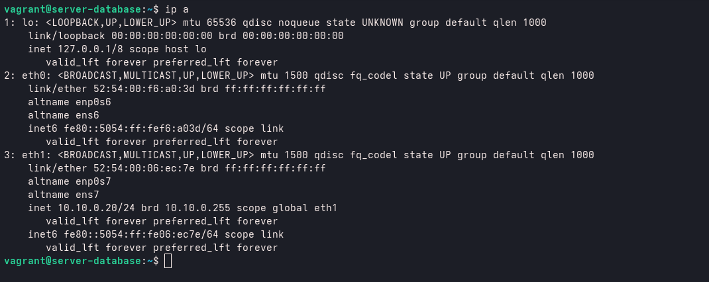
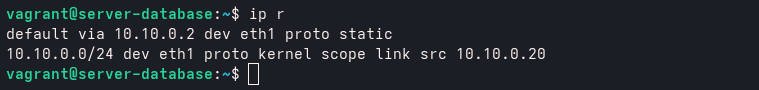
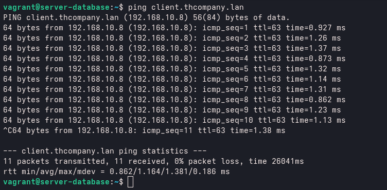

# Server Database - Armazenamento e Persistência

Servidor responsável por hospedar as bases de dados da infraestrutura. No estágio atual da topologia, o foco é o isolamento de rede, garantindo que o banco de dados não tenha acesso direto à internet de forma exposta, comunicando-se exclusivamente através do Gateway.

---

## 📌 Responsabilidade do Servidor

O servidor de banco de dados tem como função:
* **Armazenar dados críticos** da aplicação.
* **Garantir a integridade** e persistência das informações.
* **Operar em uma rede isolada** (Back-end) para maior segurança.
* **Responder apenas a requisições** vindas da rede interna (ex: Server Web).

---

## 🛠️ Sistema Operacional 

* Ubuntu Server 22.04 LTS

---

## 🌐 Tecnologia Utilizada

* **Status:** Infraestrutura de rede preparada (falatndo somente implementação de SGBD como PostgreSQL ou MySQL).

---

## 📡 Configuração de Rede Estática (Netplan)

Seguindo a política de isolamento, este servidor utiliza a interface `eth1` para a rede interna.

A configuração no diretório `/etc/netplan/01-netcfg.yaml` define o IP fixo e aponta para o Gateway da topologia.

### Arquivo YAML (`/etc/netplan/01-netcfg.yaml`):

```yaml
network:
  version: 2
  renderer: networkd
  ethernets:
    eth0:
      dhcp4: no
      optional: true
    eth1:
      addresses:
        - 10.10.0.20/24
      nameservers:
        search: [thcompany.lan]
        addresses: [10.10.0.2]
      routes:
        - to: default
          via: 10.10.0.2
```

- IP: `10.10.0.20`
- MASCARA: `/24`
- INTERFACE: `eth1`
- ROTA: `10.10.0.2`
- NAMESERVER: `thcompany.lan`

### Commando pra aplicar configuração

Pra verificar indentação correta
```bash
sudo netplan generate
```

Pra aplicar configuração
```bash
sudo netplan apply
```

<br>



<br>



### 🧪 Testando roteamento do server gateway

server-database -> server-gateway -> client



Com a configuração correta aplicada , garatimos a implementação correta do servidor dentro da organização de topologia de rede.