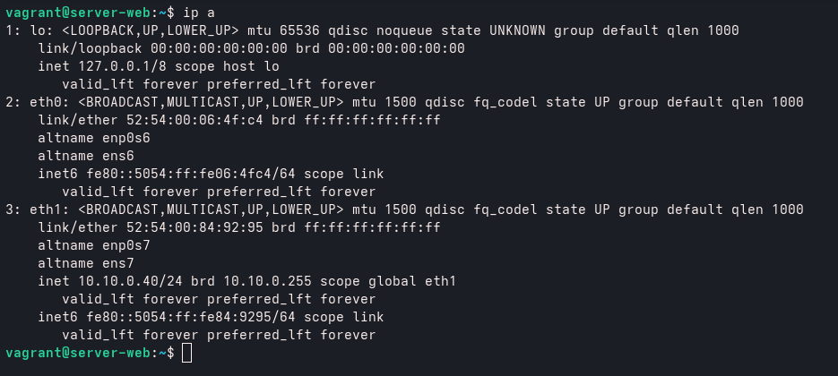
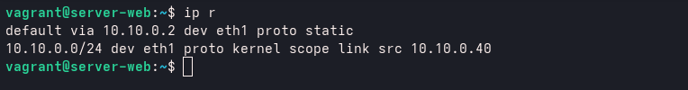
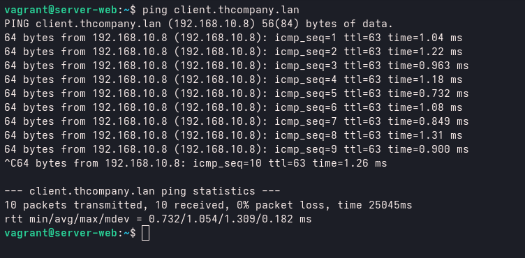
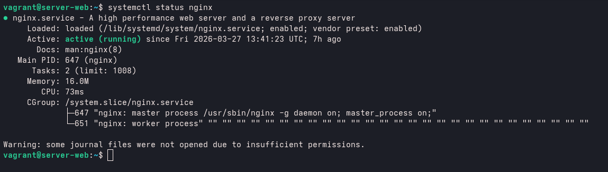
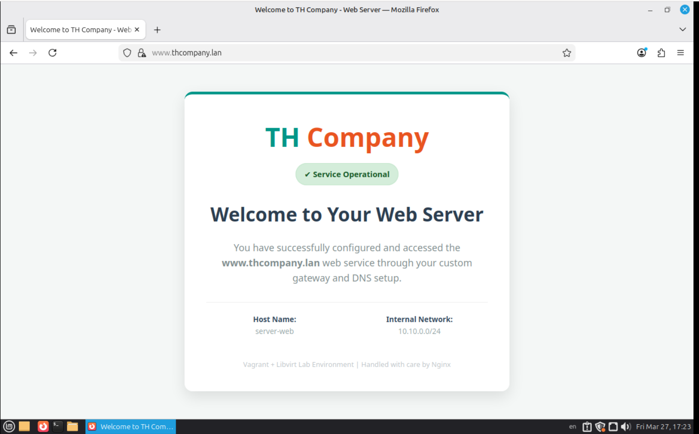

# Server Web - Nginx e HTTPS

Servidor responsável por disponibilizar o serviço web dentro da infraestrutura, sendo acessado via DNS interno através do domínio `www.thcompany.lan`.


## 📌 Responsabilidade do Servidor

O servidor web tem como função:

* Hospedar conteúdo web
* Responder requisições HTTP/HTTPS
* Trabalhar integrado com o DNS interno
* Garantir acesso seguro via HTTPS


## 🛠️  Sistema operacioal 

* Ubuntu server 22.04 LTS

## 🌐 Tecnologia Utilizada

* Nginx


## Configuração de rede estático ( networking netplan static )

Configuração estatica de rede do servidor web

No diretorio /etc/netplan , realizo a configuração do arquivo `01-netcfg.yaml` contendo as informações de ip, rota e nameserve.

Arquivo YAML:

```yaml
network:
  version: 2
  ethernets:
   eth0:
      dhcp4: no
      optional: true

   eth1:
     addresses:
       - 10.10.0.40/24
     nameservers:
       search: [thcompany.lan]
       addresses: [192.168.10.2]
     routes:
       - to: default
         via: 10.10.0.2
```

- IP: `10.10.0.40`
- MASCARA: `/24`
- INTERFACE: `eth1`
- ROTA: `10.10.0.2`
- NAMESERVER: `thcompany.lan`

### Commando pra aplicar configuração

Pra verificar indentação correta
```bash
sudo netplan generate
```

Pra aplicar configuração
```bash
sudo netplan apply
```

<br>



<br>



### Testando roteamento do server gateway

server-web -> server-gateway -> client



Com a configuração correta aplicada , garatimos a implementação correta do servidor dentro da organização de topologia de rede.


## Instalando e startando servidor web

### Intalando servidor web
```bash
sudo apt install nginx
```

### Startando servidor web e deixando start automático de servidor
```bash
sudo systemctl start nginx

sudo systemctl autostart nginx
```
<br>



## 🔐 Configuração de Certificado SSL

FCriei um certificado autoassinado para habilitar HTTPS no ambiente interno.

### Diretório de certificados

```bash
mkdir /etc/ssl/thcompany
```

---

### 🔑 Geração da chave privada

```bash
openssl genrsa -des3 -out www.thcompany.lan.key 2048
```

* Protegida com senha (PEM)

---

### 📄 Geração da requisição de certificado (CSR)

```bash
openssl req -key www.thcompany.lan.key -new -out www.thcompany.lan.key.crs
```

---

### 📜 Geração do certificado

```bash
openssl x509 -signkey www.thcompany.lan.key -in www.thcompany.lan.crs -req -days 365 -out www.thcompany.lan.crt
```

---

### 🔓 Remoção da senha da chave (para uso no Nginx)

```bash
openssl rsa -in www.thcompany.lan.key -out www.thcompany.lan.pem
```

---

### 🔐 Parâmetros Diffie-Hellman

```bash
openssl dhparam -out dhparam.pem 2028
```

---

## ⚙️ Configuração do Nginx

### Diretório de configuração

```bash
ls /etc/nginx/sites-available/
```

---

### Criação do virtual host

```bash
vim /etc/nginx/sites-available/www.thcompany.lan
```

### Configuração aplicada

```nginx
server {
	root /var/www/www.thcompany.lan;
	index index.html;
	server_name www.thcompany.lan;

	listen 443 http2 ssl;
	ssl_certificate /etc/ssl/thcompany/www.thcompany.lan.crt;
	ssl_certificate_key /etc/ssl/thcompany/www.thcompany.lan.pem;
	ssl_dhparam /etc/ssl/thcompany/dhparam.pem;
}

server {
	listen 80;
	server_name www.thcompany.lan;
	return 301 https://$host$request_uri;
}
```

### Pontos importantes:

* Porta 443 com HTTPS habilitado
* Redirecionamento automático de HTTP para HTTPS
* Uso de certificado autoassinado
* Integração com DNS interno (`www.thcompany.lan`)

---

## 📁 Estrutura do Site

### Criação do diretório

```bash
mkdir /var/www/www.thcompany.lan
```

### compiado estutura de arquivo existente pra teste

```bash
cp /var/www/html/index.nginx-debian.html /var/www/www.thcompany.lan
```

### Adicionando script html personalizado pro server web

```bash
vim /var/www/www.thcompany.lan 
```

### HTML adicionado:

[Codigo HTML customer web](/page-custome-web.html)


## 🔗 Ativação do Site

Criando link simbólico para habilitar o site:

```bash
ln -s /etc/nginx/sites-available/www.thcompany.lan /etc/nginx/sites-enabled/
```

---

## 🧪 Validação e Execução

### Testar configuração

```bash
nginx -t
```

### Reiniciar serviço

```bash
systemctl restart nginx
```

---

### Visualização de pagina web pelo navegador client



## 📌 Observações

* O acesso ao servidor depende da resolução DNS configurada no gateway
* O uso de HTTPS garante comunicação criptografada dentro da rede
* Certificado é autoassinado, ideal para ambiente de laboratório

Este servidor representa a camada de entrega de conteúdo dentro da infraestrutura.
